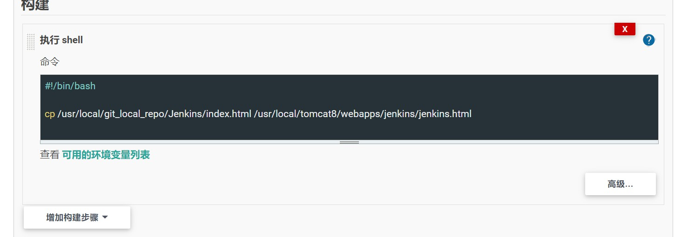
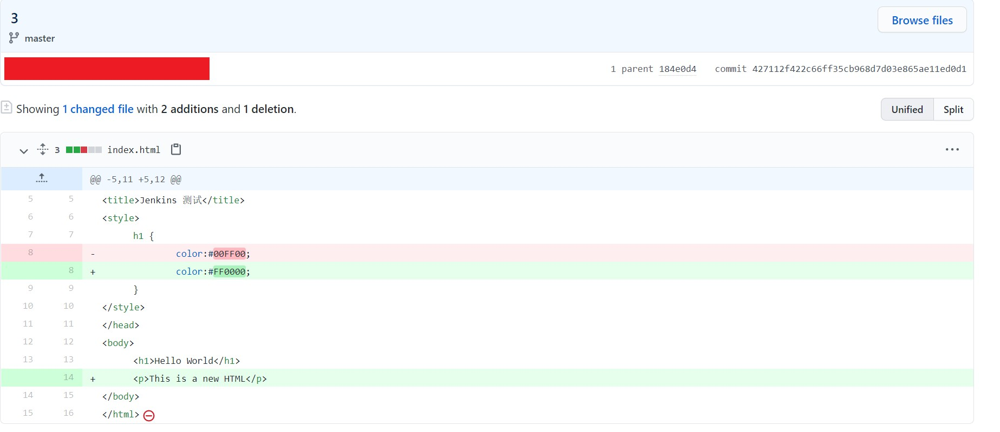

# Task - Part 2


Name: Yuan Yueshun

Faculty: 503

Group: 555амнfj


Note: 

My blog (Language: Chinese) about Jenkins: [https://www.jianshu.com/nb/49941994](https://www.jianshu.com/nb/49941994)

GitHub: [https://github.com/yysCyber](https://github.com/yysCyber)


## 1. Environment

- Windows 10
- VMware Workstation 16 Pro
- CentOS 7
- MobaXterm
- etc.


## 2. Content

Part 1：

- 2.1. Preparation before installing Jenkins.
- 2.2. Install Jenkins.
- 2.3. Basic operations of Jenkins.
- 2.4. Plugins of Jenkins.

Part 2:

- 2.5. Item of Jenkins.
- 2.6. Node of Jenkins.
- 2.7. Git of Jenkins.


### 2.5. Item of Jenkins

Item is very import concept in Jenkins. If we want to execute deploy operations and more operations, we should create an item first.

There are many types of item, such as "Freestyle project", "Pipeline", etc.. We should choose the suitable item according to the software project.

The following is an example, create an item (the type is "Freestyle project"), and build the item to execute a shell script in current Linux.

- Step 1:

  Click "New Item" in the main page, or input `http://ip:port/view/all/newJob` (example: `http://192.168.3.43:8777/view/all/newJob`):

  

  
  
- Step 2:

  Choose item type ("Freestyle project") and give a name, then click "OK" button:

  

  

- Step 3:

  Configure the item. The target of the item is executing a shell script, so click "Build" tab on the top, then select "Execute shell":

  

  

- Step 4:

  Write a shell script in the text area, then click "SAVE" button to save the item:

  

  

- Step 5:

  Build the item. In the item main page, click "Build Now", wait a moment:

  

  

- Step 6:

  If build successfully, we can see a blue ball:

  

  

- Step 7:

  Check "Console Output":

  


### 2.6. Node of Jenkins

We use the node to control other server (Linux) remotely. Generally, one node can control one server (Linux).

The following is an example, the current host IP is `192.168.3.43` (Jenkins is deployed on this host), create a node to control another host (IP: `192.168.3.42`).

- Step 1:

  Install two plugins: "[Publish Over SSH](https://plugins.jenkins.io/publish-over-ssh)" and "[SSH Build Agents plugin](https://plugins.jenkins.io/ssh-slaves)"

  

- Step 2:

  Click "Manage Jenkins" in the main page, then click "Manage Nodes and Clouds":

  

  

  

  

- Step 3:

  Click "New Node":

  

  

- Step 4:

  Configure the node. Name, remote IP, remote root directory, launch method, etc.:

  

  

- Step 5:

  Configure the credentials, choose or add a new credential:

  

  

  If add a new credential, generally, `Username with password` or `SSH Username with private key`:

  

  

  

  

- Step 6:

  Choose "Host Key Verification Strategy", there are 4 strategies: "Known hosts file Verification Strategy", "Manually provided key Verification Strategy", "Manually trusted key Verification Strategy", "Non verifying Verification Strategy". 

  I choose "Manually provided key Verification Strategy" because both hosts have connected by SSH before.

  

  

- Step 7:

  Advanced configurations, such as "Java path on the remote host". Click "ADVANCED" button:

  

  

  

- Step 8:

  Click "SAVE" button, finish creating a new node.

  

- Step 9:

  Create a new item, the item will be built on the node that created.

  The target of the item is also executing a shell script (the command `ifconfig`).

  

  Open the configuration page of the item, 

  click "General" tab, check "Restrict where this project can be run", then choose the node that the current item will be built on.

  

  

- Step 9:

  Build the item, if it is correct, the result of the command `ifconfig` will show `192.168.3.42`:

  

  

  


### 2.7. Git of Jenkins

There is no doubt that Git is very important and necessary in software development. Submitting codes to the remote repository (GitHub, GitLab, etc.) by Git is very common.

Jenkins can help programmers deploy the software conveniently after they submit codes to the remote repository.

The following is an example. Create a repository on GitHub, submit an HTML file to the repository (We can see the HTML file as a software project). Deploy the HTML file into Tomcat (or other server software) by Jenkins when you finish editing the HTML file and submitting it to the repository.

Jenkins and Git are deployed on the host, IP is `192.168.3.43`. 

Java and Tomcat are deployed on another host, IP is `192.168.3.42`.

`192.168.3.43` will control `192.168.3.42` by a node of Jenkins.


- Step 1:

  Create a repository named "Jenkins" on GitHub, then create an HTML file, write some codes in the HTML file, then submit it to the repository:

  ```html
  <!DOCTYPE html>
  <html>
  <head>
  <meta charset="utf-8">
  <title>Jenkins 测试</title>
  <style>
  	h1 {
  		color:#FF0000;
  	}
  </style>
  </head>
  <body>
  	<h1>Hello World</h1>
  </body>
  </html>
  ```


- Step 2:

  Configure Git in Jenkins. Click "Manage Jenkins" in the main page, then click "Global Tool Configuration":

  

  

- Step 3:

  Fill configurations about Git:

  

  

- Step 4:

  Create a new item (Freestyle project), configure the item.

  Choose the node that the item will be built on;

  In "Source Code Management", check "Git", then fill the address of the remote repository, etc.;

  Save the item:

  

  

  

  

  

  

- Step 5:

  Build the item. 

  If codes are pulled from the remote repository to the target directory (`192.168.3.42`, `/usr/local/git_local_repo/Jenkins`) successfully, it is OK:

   

  

  

  

- Step 6:

  Configure the item, edit building strategy, the strategy is "Execute shell", the shell script is moving the HTML file to Tomcat:

  

  

- Step 7:

  Build the item. Start Tomcat:

  

  

- Step 8:

  Edit the HTML file, then push to the remote repository:

  ```html
  
  <!DOCTYPE html>
  <html>
  <head>
  <meta charset="utf-8">
  <title>Jenkins 测试</title>
  <style>
  	h1 {
  		color:#FF0000;
  	}
  </style>
  </head>
  <body>
  	<h1>Hello World</h1>
  	<p>This is a new HTML</p>
  </body>
  </html>
  ```

  

  

- Step 9:

  Build the item again, refresh the page:

  

